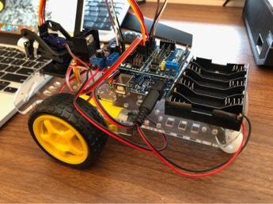
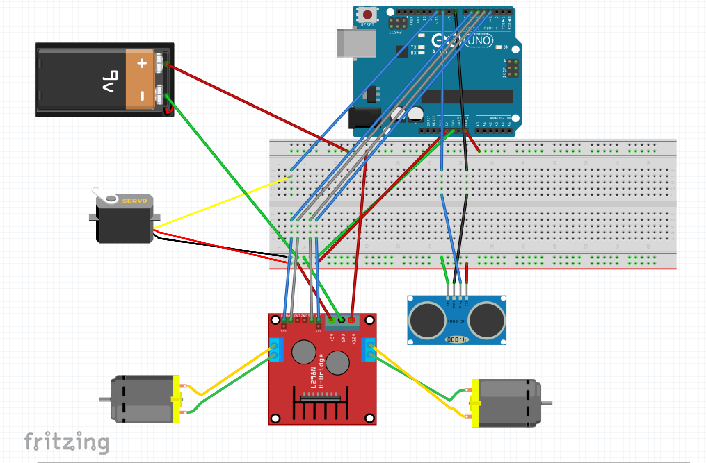
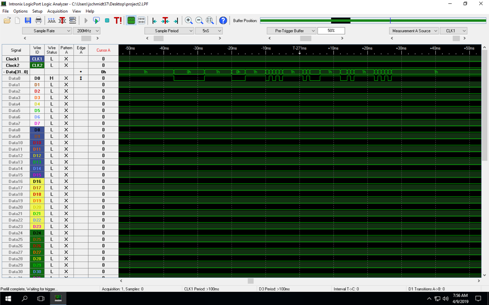

# Schmidt_CSCE_236

This a a simple self driving car developed for an Embedded Systems class at the University of Nebraska-Lincoln. It maintains a constant distance from the wall as well as navigating obstacles in the way. The car consists of a chasis, ultrasonic rangefinder, servo, arduino uno, arduino uno sensor shield, h-bridge, 2 DC motors, and 2 wheels. It was programmed entirely without the use of the arduino libraries and only relies on using timer counters for functionality. Wiring schematic for the car is shown below:

Additional functionality was added to include a remote to control the car. An IR sensor was used to collect data from the remote and an oscilloscope was used to figure out the values of the  different button presses(example in image below).

Basic Functions built using timer counters:

	wheelForward - sets both wheels forward at once
	
	wheelStop - stops the car
	
	initCar - detects which side of the car the wall is on
	
	checkWall - sees how far away the wall is from the car
	
	delay1 - custom delay function using a combination of an integer for loop and a 16-bit for loop
	
	sTurnLeft - has the car make a small left turn
	
	sTurnRight - has the car make a small right turn
